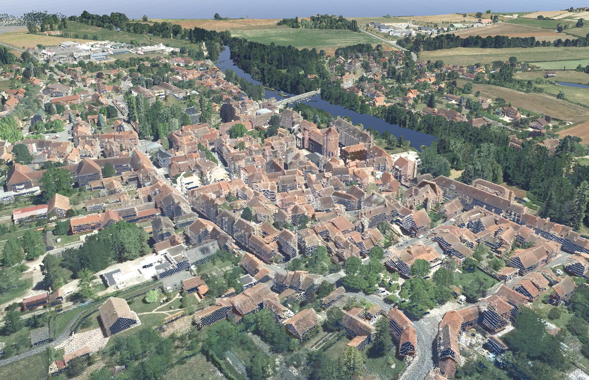
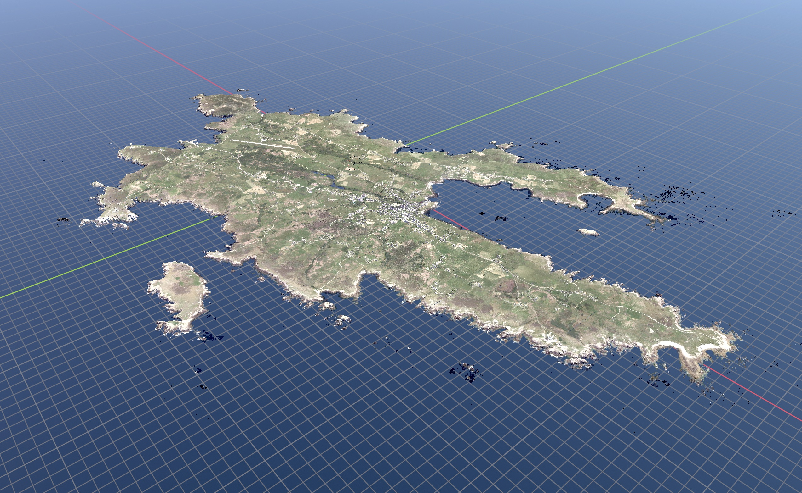
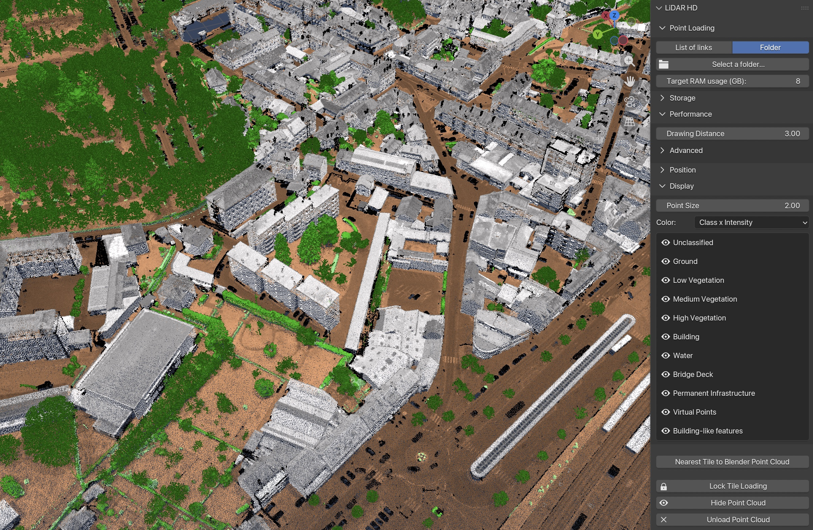
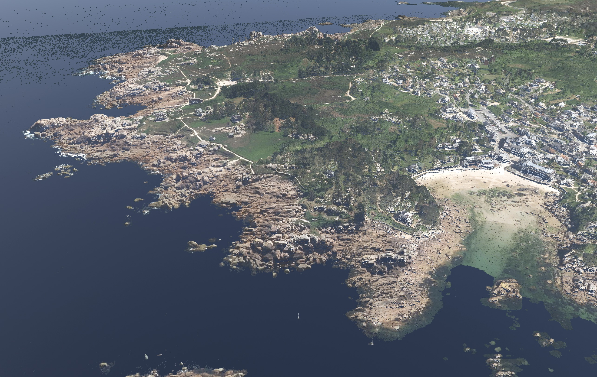
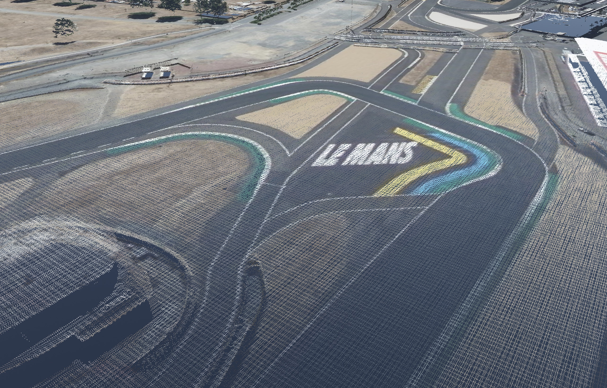
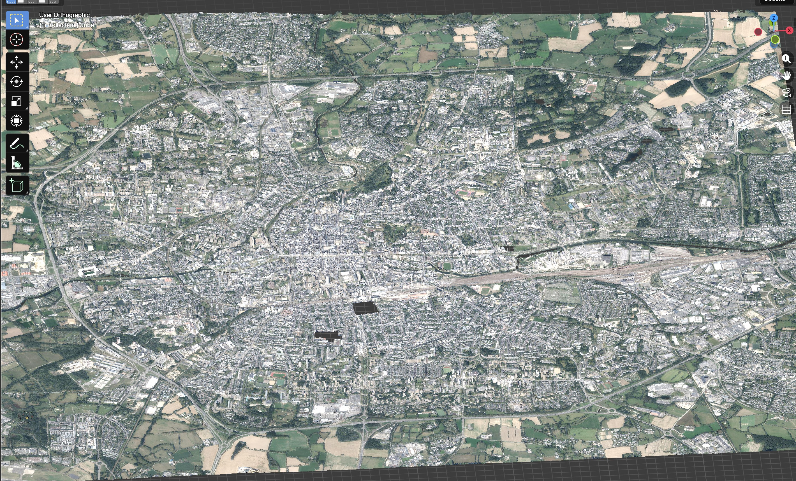

# Blender-LiDAR-HD-Tool

A Blender Add-on for visualizing and importing IGN LiDAR HD point cloud tiles.

## Description

LiDAR HD Tool is a Blender Add-on for visualizing and importing point clouds from the [IGN](https://www.ign.fr)'s [LiDAR HD](https://geoservices.ign.fr/lidarhd) project into Blender.

The point clouds are rendered in the 3D viewport using a custom GPU shader, and the tiles are dynamically loaded in and out depending on the viewport camera's position.

This add-on is designed to provide a lightweight preview of the point clouds to use as a reference for modeling over. Its RAM usage is configurable to be as much or as little as you want.

When needed, this add-on can convert the point clouds into Blender's native Point Cloud objects, for further use with Geometry Nodes, Shader Nodes, and as a shrinkwrap base.

LiDAR HD Tool is compatible with MacOS, Linux and Windows.

> [!WARNING]
> Only the Vulkan and Metal backends are supported for visualization.

*The island of Ouéssant in 1:1 scale in Blender. 10 points per square metre.*

*Points tinted by their class and shaded by their signal strength in Nevers.*

## Quick Start Guide

### Installing the add-on

- Download the add-on [here](https://github.com/BastianCtld/Blender-LiDAR-HD-Tool/releases/latest).

- Do not unzip the .zip file.

- In Blender, go to Edit→Preferences...→Get Extensions

- Allow online access while you are here if you haven't already. This will be useful to let Blender download the point clouds for you.

- In the top right corner of the Preference window, click the down-facing arrow, and choose "Install from Disk...".

- Select the zip file you downloaded.

The LiDAR HD Tool should appear in the "Installed" list.

### Using the add-on

- Press N to bring out the 3D Viewport's sidebar.

A "LiDAR HD" tab should be present.
- Select the LiDAR HD tab to reveal the one and only panel of this add-on.

- Click "Open the Download Interface..." which takes you to the IGN's official download interface.

- Select the tiles you wish to see, and click on the download icon on the right side of the page. Choose "Liens de téléchargement".

- This will download a text file containing a list of tiles to load.

- Back in Blender, click on "Load a dalle.txt..." and point to the text file you just downloaded.

Blender will download the tiles listed. Once downloaded, they will show in the 3D viewport once you move around your camera around.

> [!TIP]
> A single tile takes up around 100 MB. Select Storage→Open Cache Folder to see and delete the point clouds and images the add-on has downloaded over time.

- In the View tab of the side panel, adjust the Clip Start and End values to adjust how far you can see.

> [!IMPORTANT]
> Make sure to adjust both the Clip Start and End proportionally (when multiplying Clip Far by 10, multiply Clip Start by 10 as well). This prevents flickering caused by floating point precision limits.

You're done!

## Building the Add-on

With Python installed, clone this repository and run "build.py".

This will install all the wheels for every platform into the "wheels" folder, and create the add-on zip file.

## Known limitations

- The camera hitches when loading in new tiles. This is currently unavoidable because GPUBatch creation blocks the UI thread, and lazrs seems to block it as well when decompressing the fetched points.
- Exporting the point cloud doesn't keep the BD Ortho aerial image colors. I can't imagine a use case for it to justify the development of the feature.

## Contact

Bastian Cataldi - bastian.cataldi@free.fr

 
 

## Some more pictures

*Ploumanac'h's rose granit coast.*

*Circuit du Mans, in the Sarthe region.*

*Rennes at 1:1 scale in Blender.*
